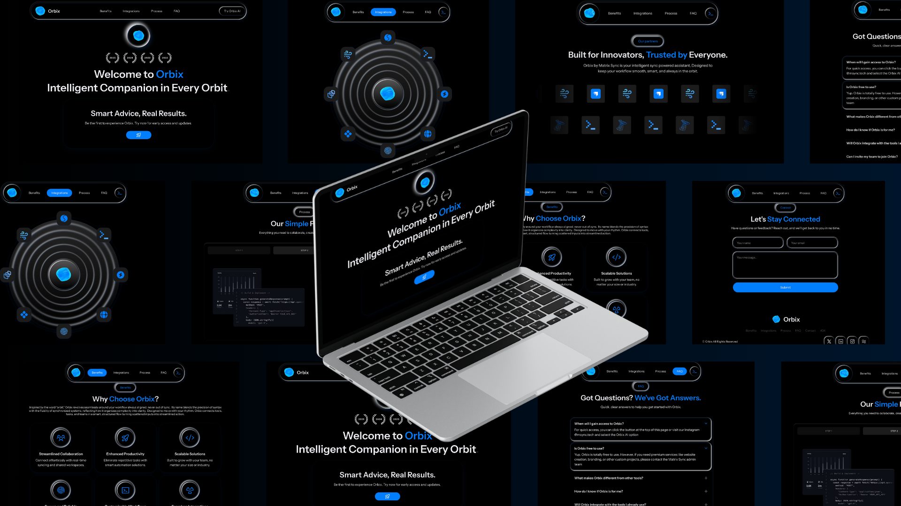

# 🌌 Orbix AI  

**Welcome to Orbix**  
*Intelligent Companion in Every Orbit.*  
*Smart Advice, Real Results.*  

Be the first to experience Orbix. Try now for early access and updates.  

---

## 🖼️ Preview  

  

## 🎯 Tentang Orbix  

Orbix adalah asisten cerdas yang membantu menjaga workflow tetap sinkron, pintar, dan efisien.  
Dengan Orbix, kamu bisa meningkatkan produktivitas, berkolaborasi lebih mudah, dan merasakan otomatisasi yang benar-benar relevan dengan kebutuhan tim maupun individu.  

---

## ✨ Fitur Utama  

- 🚀 **Smart Collaboration** — Kolaborasi real-time tanpa hambatan  
- 🤖 **AI-Powered Insights** — Saran cerdas untuk hasil nyata  
- 🔒 **Keamanan Data** — Perlindungan data setara enterprise  
- ⚙️ **Custom Workflows** — Sesuaikan alur kerja dengan kebutuhan tim  
- 📈 **Scalable** — Dapat berkembang sesuai ukuran organisasi  

---
### 📄 LICENSE  

```text
MIT License

Copyright (c) 2025 By Matrix Sync

Permission is hereby granted, free of charge, to any person obtaining a copy
of this software and associated documentation files (the "Software"), to deal
in the Software without restriction, including without limitation the rights  
to use, copy, modify, merge, publish, distribute, sublicense, and/or sell  
copies of the Software, and to permit persons to whom the Software is  
furnished to do so, subject to the following conditions:  

The above copyright notice and this permission notice shall be included in all  
copies or substantial portions of the Software.  

THE SOFTWARE IS PROVIDED "AS IS", WITHOUT WARRANTY OF ANY KIND, EXPRESS OR  
IMPLIED, INCLUDING BUT NOT LIMITED TO THE WARRANTIES OF MERCHANTABILITY,  
FITNESS FOR A PARTICULAR PURPOSE AND NONINFRINGEMENT. IN NO EVENT SHALL THE  
AUTHORS OR COPYRIGHT HOLDERS BE LIABLE FOR ANY CLAIM, DAMAGES OR OTHER  
LIABILITY, WHETHER IN AN ACTION OF CONTRACT, TORT OR OTHERWISE, ARISING FROM,  
OUT OF OR IN CONNECTION WITH THE SOFTWARE OR THE USE OR OTHER DEALINGS IN THE  
SOFTWARE.
